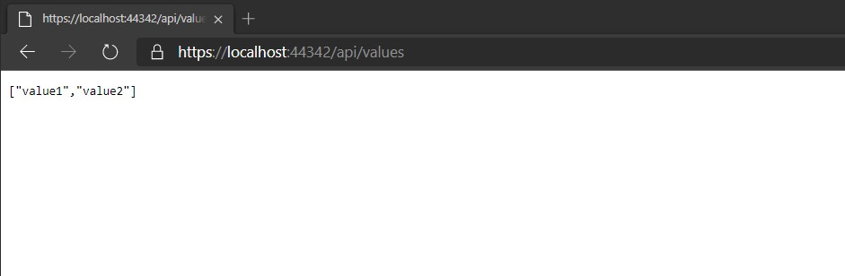
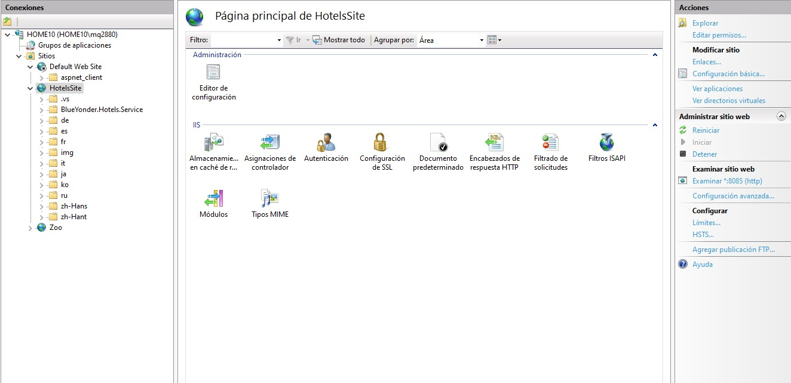
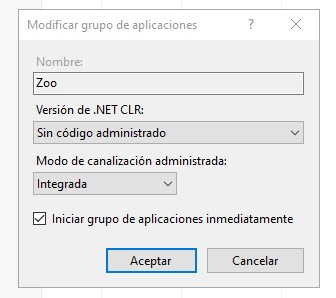
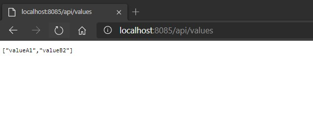

# Lesson 5: Automatically Generating HTTP Requests and Responses

### Demonstration: Hosting web API in IIS and IIS Express

- Abrimos el proyecto HostingISSAndISSExpress en Visual Studio 2019

- Ejecutamos

  

- Abrimos **Internet Information Services(IIS) Manager**

- creamos un nuevo site con el nombre **HotelsSite** en el puerto 8085

  

  

  

- En el Application pool del site cambiamos  **.NET CLR version** por **No Managed Code**

  

- Publicamos desde Visual Studio

- Abrimos el navegador con la url **localhost:8085/api/Values**

  

